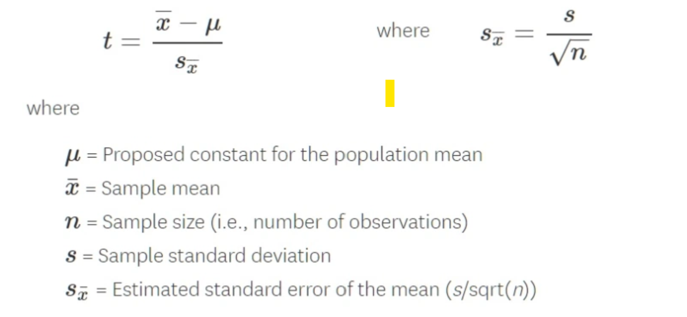

# Hypothesis Testing

A method to compare two opposite assumptions about a population using sample data to determine which is more likely true.

| Concept | Description |
|---------|-------------|
| **Null Hypothesis (H₀)** | Assumes no effect or relationship exists |
| **Alternative Hypothesis (H₁)** | Suggests an effect or relationship does exist |
| **Type I Error (α)** | Rejecting a true null hypothesis (false positive) |
| **Type II Error (β)** | Failing to reject a false null hypothesis (false negative) |
| **p-Value** | Probability of obtaining the observed results under H₀; small p → reject H₀ |

**Common Tests:**

| Test | Purpose |
|------|---------|
| **t-Test** | Compare means of one or two groups (small samples) |
| **z-Test** | Compare means when population std dev is known (large samples) |
| **ANOVA** | Compare means across three or more groups |
| **Chi-Square Test** | Assess association between categorical variables |

## T Test

A t-test is a type of inferential statistic which is used to determine if there is a significant difference between the means of two groups which may be related in certain features

T-test has 2 types : 1. one sampled t-test 2. two-sampled t-test.

##  One-sample T-test with Python

The test will tell us whether means of the sample and the population are different
